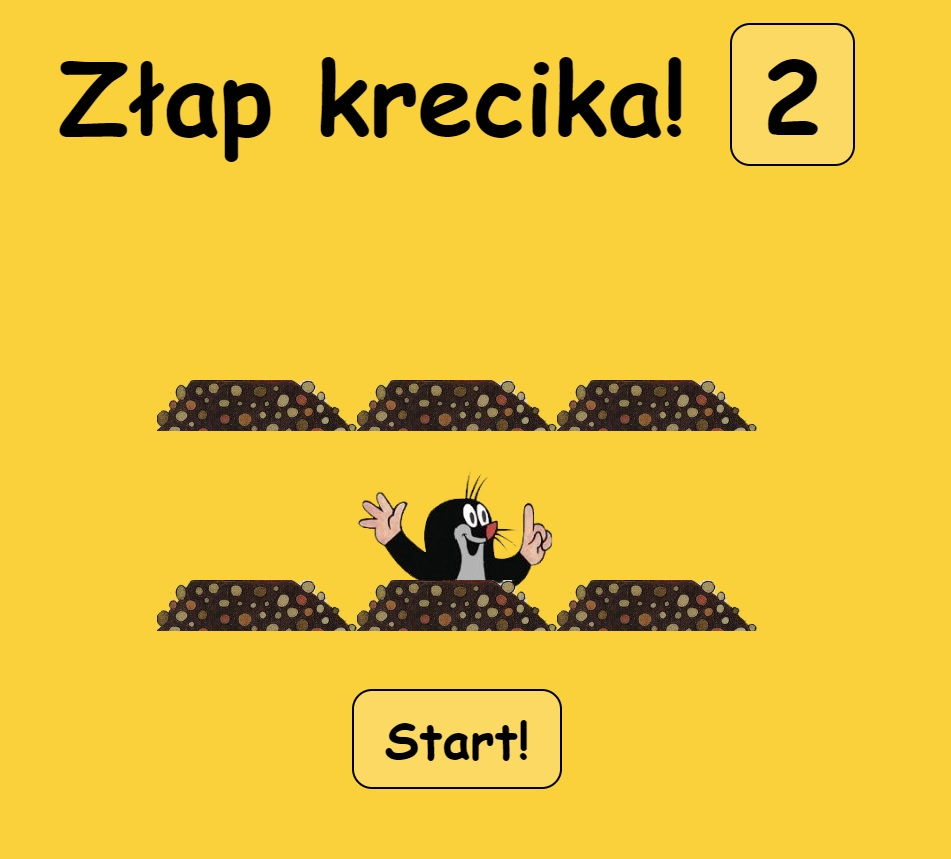

# xxx

## Table of contents

* [General info](#general-info)
* [Screenshots](#screenshots)
* [Technologies](#technologies)
* [Setup](#setup)
* [Status](#status)

## General info
My project is a game in which you have to catch a mole "krecik" with your mouse to get points.

## Screenshots

## Technologies
* JavaScript 
* CSS3 - grid 
* HTML5 

## Demo
https://github.com/BadVilgo/xxx/

## Status
Project is: _inProgres_.

